# Теория распространения оптического поля и атмосферной турбулентности

В данной главе описывается физическая и математическая основа численного моделирования оптического поля в свободном пространстве и в турбулентной атмосфере. Рассматриваются комплексная амплитуда поля, интенсивность, фаза, фурье-метод распространения, фазовые экраны и параметры, задающие статистику атмосферной турбулентности.

Материал имеет вводный характер: его цель состоит не в описании конкретной нейросетевой архитектуры, а в объяснении модели среды и тех физических величин, которые затем используются при генерации численных данных и интерпретации результатов моделирования.

---

# 1. Комплексная амплитуда оптического поля

## 1.1. Переход от реального поля к комплексной амплитуде

Реальное электрическое поле электромагнитной волны быстро осциллирует во времени. Для монохроматического излучения с циклической частотой $\omega$ его удобно представить через комплексную амплитуду:

$$
\mathbf E_{\mathrm{real}}(x,y,z,t)
=
\operatorname{Re}
\left[
\mathbf E(x,y,z)e^{-i\omega t}
\right].
$$

В этом представлении вся быстрая временная зависимость вынесена в множитель $e^{-i\omega t}$, а пространственное распределение поля содержится в комплексной амплитуде $\mathbf E(x,y,z)$. Если поляризация считается фиксированной и отдельно не моделируется, в расчётах используется скалярная комплексная амплитуда

$$
U(x,y,z)=A(x,y,z)e^{i\varphi(x,y,z)}.
$$

Здесь:

| Обозначение | Смысл |
|---|---|
| $U(x,y,z)$ | комплексная амплитуда оптического поля |
| $A(x,y,z)$ | вещественная амплитуда поля |
| $\varphi(x,y,z)$ | фаза поля |
| $x,y$ | поперечные координаты |
| $z$ | продольная координата распространения |

В начальной плоскости поле задаётся как

$$
U_0(x,y)=A_0(x,y)e^{i\varphi_0(x,y)}.
$$

Именно эта величина является исходным объектом численного моделирования. Распространение поля, действие апертуры, влияние турбулентности и работа оптических элементов сводятся к преобразованию комплексной функции $U(x,y,z)$.

---

## 1.2. Гауссово начальное поле

Одной из стандартных моделей лазерного пучка является гауссов пучок. В начальной плоскости его можно задать выражением

$$
U_0(x,y)
=
U_{\max}
\exp
\left[
-\frac{(x-x_0)^2+(y-y_0)^2}{w_0^2}
\right]
e^{i\varphi_0(x,y)}.
$$

Здесь $(x_0,y_0)$ задают положение центра пучка в расчётной области, $U_{\max}$ — амплитудный масштаб, а $w_0$ — характерный радиус пучка. В используемой записи $w_0$ относится к амплитуде: при $r=w_0$ амплитуда уменьшается в $e$ раз, а интенсивность — в $e^2$ раз. Поэтому при сравнении разных соглашений о радиусе пучка важно уточнять, определяется ли радиус через амплитуду или через интенсивность.

Если начальная фаза $\varphi_0(x,y)$ равна нулю, то пучок в начальной плоскости имеет плоский волновой фронт. Если в фазу добавлен линейный член, поле соответствует наклонённому пучку. Если фаза содержит квадратичный член, это соответствует сферическому волновому фронту или дефокусировке.

  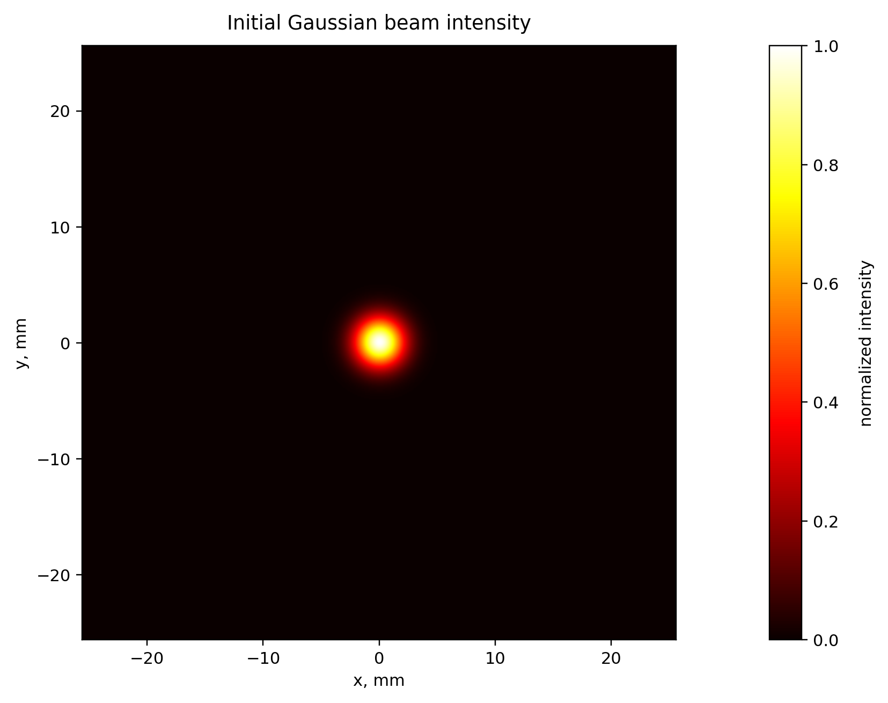

<em>Рисунок 1 — Начальное распределение нормированной интенсивности гауссова пучка. Максимум интенсивности расположен в центре расчётной области, а спад по радиусу имеет гауссов характер.</em>

  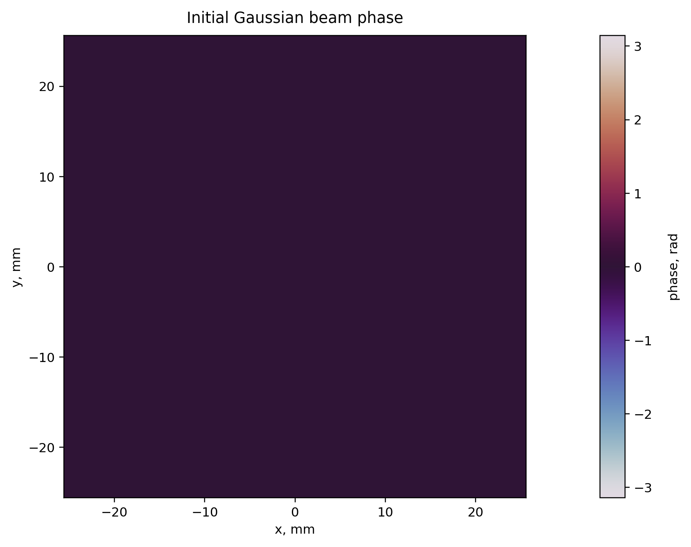

<em>Рисунок 2 — Начальная фаза гауссова пучка. Для пучка без дополнительного фазового возмущения фаза является постоянной с точностью до численных особенностей отображения аргумента комплексного числа.</em>

---

## 1.3. Другие типы начальных полей и апертурное ограничение

Для моделирования более резких профилей можно использовать супергауссов пучок порядка $m$:

$$
U_0(x,y)
=
U_{\max}
\exp
\left[
-\left(
\frac{\sqrt{(x-x_0)^2+(y-y_0)^2}}{w_0}
\right)^m
\right].
$$

При $m=2$ получается обычный гауссов профиль. При увеличении $m$ центральная часть пучка становится более плоской, а край — более резким. Такая модель удобна, когда необходимо приблизить пучок с почти равномерной интенсивностью в центре, но без идеально жёсткой границы.

Если пучок ограничен круглой апертурой радиуса $R$, вводится апертурная функция

$$
P_R(x,y)
=
\begin{cases}
1, & (x-x_a)^2+(y-y_a)^2\le R^2,\\
0, & (x-x_a)^2+(y-y_a)^2>R^2.
\end{cases}
$$

Тогда поле после апертуры имеет вид

$$
U_0^{(\mathrm{ap})}(x,y)=U_0(x,y)P_R(x,y).
$$

Апертурное ограничение важно потому, что реальная оптическая система всегда имеет конечный размер. Обрезание поля апертурой изменяет пространственный спектр и приводит к дифракционным эффектам при дальнейшем распространении.

---

## 1.4. Интенсивность

Интенсивность оптического поля пропорциональна квадрату модуля комплексной амплитуды:

$$
I(x,y,z)\propto |U(x,y,z)|^2.
$$

В численных экспериментах часто используется нормированная интенсивность

$$
I_{\mathrm{norm}}(x,y,z)
=
\frac{|U(x,y,z)|^2}{\max_{x,y}|U(x,y,z)|^2}.
$$

Нормировка удобна для визуализации и сравнения формы распределений, но она скрывает абсолютное изменение мощности. Поэтому при проверке численной схемы дополнительно контролируют интегральную мощность

$$
P(z)=\iint |U(x,y,z)|^2\,dx\,dy.
$$

В дискретной модели с шагом сетки $\Delta x=\Delta y$ эта величина вычисляется как

$$
P(z)\approx \sum_{j,k}|U_{jk}(z)|^2\Delta x^2.
$$

Для свободного распространения без поглощения и без обрезания поля границами расчётной области эта величина должна сохраняться. Поэтому сохранение $P(z)$ является простой, но важной проверкой корректности численного распространения.

  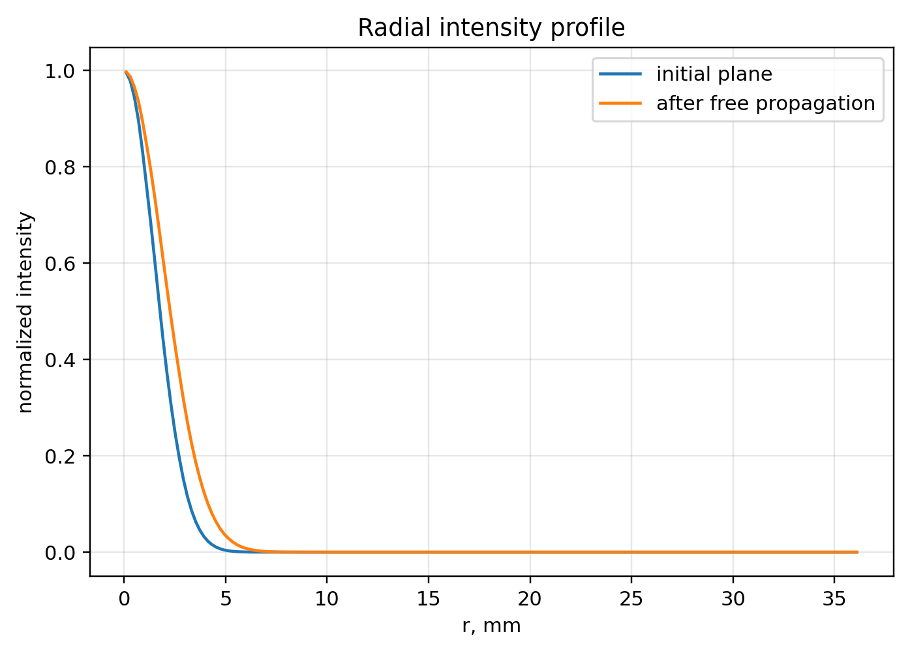

<em>Рисунок 3 — Радиальный профиль нормированной интенсивности в начальной плоскости и после свободного распространения. Изменение ширины профиля связано с дифракционным уширением пучка.</em>

---

## 1.5. Фаза

Фаза комплексного поля определяется как аргумент комплексного числа:

$$
\varphi(x,y,z)=\arg U(x,y,z).
$$

Если

$$
U=U_{\mathrm{Re}}+iU_{\mathrm{Im}},
$$

то фаза вычисляется как

$$
\varphi=\operatorname{atan2}(U_{\mathrm{Im}},U_{\mathrm{Re}}).
$$

Фаза, полученная как аргумент комплексного числа, задана по модулю $2\pi$. Обычно она отображается в диапазоне

$$
(-\pi,\pi].
$$

Такую фазу называют завёрнутой:

$$
\varphi_{\mathrm{wrapped}}=\varphi \mod 2\pi.
$$

Если требуется восстановить непрерывный волновой фронт, выполняют развёртку фазы. Однако в областях малой интенсивности фаза становится плохо определённой: при $|U|\approx0$ даже малый численный шум может сильно менять значение $\arg U$. Поэтому фазовые карты следует анализировать совместно с распределением интенсивности.

---

# 2. Численная сетка и параметры моделирования

Численное моделирование выполняется на конечной двумерной сетке. Если расчётная область имеет размер $L_x=L_y=L_{\mathrm{box}}$, а число узлов по каждой координате равно $N$, то шаг сетки равен

$$
\Delta x=\Delta y=\frac{L_{\mathrm{box}}}{N}.
$$

Поперечные координаты обычно задаются как

$$
x_j=\left(j-\frac{N}{2}\right)\Delta x,
\qquad
 y_k=\left(k-\frac{N}{2}\right)\Delta x.
$$

Размер области должен быть достаточно большим, чтобы поле не взаимодействовало с границами при распространении. С другой стороны, шаг $\Delta x$ должен быть достаточно малым, чтобы корректно описывать поперечную структуру поля и фазовых экранов.

Для рисунков в данном разделе использован следующий набор параметров:

| Параметр | Значение | Физический смысл |
|---|---:|---|
| $N$ | 1024 | число узлов сетки по каждой координате |
| $L_{\mathrm{box}}$ | 0.05 м | размер расчётной области |
| $\Delta x$ | $L_{\mathrm{box}}/N$ | пространственный шаг сетки |
| $\lambda$ | 650 нм | длина волны излучения |
| $z$ | 50 м | расстояние свободного распространения |
| $w_0$ | 2 мм | характерный радиус начального гауссова пучка |
| $r_0$ | 5 см | параметр Фрида для всей турбулентной трассы |
| $L_0$ | 10 м | внешний масштаб турбулентности |
| $l_0$ | 1 мм | внутренний масштаб турбулентности |
| $N_{\mathrm{screens}}$ | 5 | число фазовых экранов на трассе |

Эти значения используются как демонстрационные. Они позволяют показать характерные эффекты: дифракционное уширение гауссова пучка, появление неоднородной фазовой структуры и искажение поля после прохождения через турбулентную трассу.

---

# 3. Распространение поля в свободном пространстве

## 3.1. Уравнение Гельмгольца

В однородной среде комплексная амплитуда монохроматического поля удовлетворяет уравнению Гельмгольца:

$$
\nabla^2 U+k^2U=0,
$$

где

$$
k=\frac{2\pi}{\lambda}
$$

— волновое число. Задача распространения состоит в том, чтобы по известному полю $U(x,y,0)$ найти поле $U(x,y,z)$ в другой поперечной плоскости.

---

## 3.2. Метод углового спектра

Метод углового спектра основан на представлении поля как суперпозиции плоских волн. Сначала берётся двумерное преобразование Фурье начального поля:

$$
\tilde U(f_x,f_y,0)=\mathcal F\{U(x,y,0)\}.
$$

Здесь $f_x$ и $f_y$ — пространственные частоты в циклах на метр. Им соответствуют волновые числа

$$
k_x=2\pi f_x,
\qquad
k_y=2\pi f_y.
$$

Для каждой плоской волны продольная компонента волнового вектора равна

$$
k_z=\sqrt{k^2-k_x^2-k_y^2}.
$$

При распространении на расстояние $z$ соответствующая спектральная компонента набирает фазовый множитель

$$
H(f_x,f_y,z)=\exp(ik_z z).
$$

Итоговое поле находится обратным преобразованием Фурье:

$$
U(x,y,z)=
\mathcal F^{-1}
\left[
\tilde U(f_x,f_y,0)H(f_x,f_y,z)
\right].
$$

В операторной форме это можно записать как

$$
U_z=\mathcal P_z U_0,
$$

где $\mathcal P_z$ — оператор свободного распространения на расстояние $z$.

  

<em>Рисунок 4 — Нормированная интенсивность гауссова пучка после свободного распространения. По сравнению с начальной плоскостью пучок становится шире из-за дифракции.</em>

  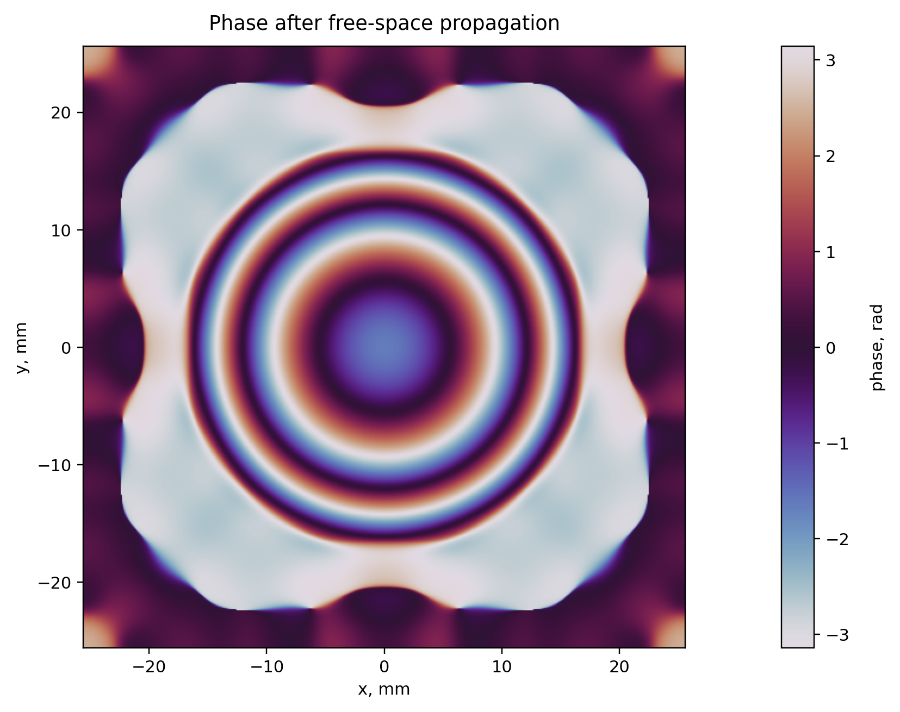

<em>Рисунок 5 — Фаза после свободного распространения. Даже если начальная фаза постоянна, при распространении формируется неплоский волновой фронт, связанный с дифракцией и кривизной фронта пучка.</em>

---

## 3.3. Эванесцентные компоненты

Если выполняется условие

$$
k_x^2+k_y^2>k^2,
$$

то $k_z$ становится мнимым. Такие спектральные компоненты называются эванесцентными. Они не соответствуют распространяющимся плоским волнам и экспоненциально затухают с расстоянием.

В задачах распространения на макроскопические расстояния эванесцентные компоненты обычно несущественны. Поэтому в численной реализации для них можно положить

$$
H(f_x,f_y,z)=0.
$$

Это стабилизирует расчёт и исключает нефизическое усиление высокочастотных компонент.

---

## 3.4. Параксиальное приближение и дифракция Френеля

Если поле распространяется преимущественно вдоль оси $z$, а поперечные углы малы, можно использовать параксиальное приближение:

$$
k_z=\sqrt{k^2-k_x^2-k_y^2}
\approx
k-\frac{k_x^2+k_y^2}{2k}.
$$

Тогда передаточная функция принимает вид

$$
H_{\mathrm{Fresnel}}(f_x,f_y,z)
=
\exp(ikz)
\exp
\left[
-i\pi\lambda z(f_x^2+f_y^2)
\right].
$$

Это выражение соответствует дифракции Френеля. Оно является приближением точного метода углового спектра и хорошо работает для малых углов распространения, когда вклад больших поперечных пространственных частот невелик.

В координатной форме поле в приближении Френеля можно записать как

$$
U(x,y,z)=
\frac{e^{ikz}}{i\lambda z}
\iint
U_0(\xi,\eta)
\exp
\left[
\frac{ik}{2z}
\left((x-\xi)^2+(y-\eta)^2\right)
\right]
d\xi d\eta.
$$

---

## 3.5. Приближение Фраунгофера и число Френеля

При достаточно большом расстоянии распространения возникает дальняя зона, или область Фраунгофера. Характерный критерий имеет вид

$$
z\gg \frac{D^2}{\lambda},
$$

где $D$ — характерный размер апертуры или пучка. В дальней зоне поле пропорционально фурье-образу начального распределения:

$$
U(x,y,z)
\propto
\mathcal F\{U_0(\xi,\eta)\}
\bigg|_{f_x=x/(\lambda z),\, f_y=y/(\lambda z)}.
$$

Для оценки режима дифракции удобно использовать число Френеля

$$
N_F=\frac{a^2}{\lambda z},
$$

где $a$ — радиус апертуры. При $N_F\gg1$ поле находится в ближней зоне, при $N_F\sim1$ существенны эффекты Френеля, а при $N_F\ll1$ применимо приближение Фраунгофера.

---

# 4. Атмосферная турбулентность

## 4.1. Случайный показатель преломления

В атмосфере показатель преломления не является строго постоянным. Его можно представить в виде

$$
n(\mathbf r)=n_0+n_1(\mathbf r),
$$

где $n_0$ — среднее значение, а $n_1(\mathbf r)$ — случайная флуктуация, связанная с неоднородностями температуры, давления и плотности воздуха. При прохождении через такую среду волна накапливает фазу

$$
\varphi(\mathbf r)=k\int n(\mathbf r)\,ds.
$$

Турбулентная часть фазового набега задаётся выражением

$$
\phi(\mathbf r_\perp)=
k\int n_1(\mathbf r_\perp,z)\,dz,
$$

где $\mathbf r_\perp=(x,y)$ — поперечная координата. Именно эта величина приводит к искажению волнового фронта.

---

## 4.2. Структурная функция и параметр $C_n^2$

Статистика флуктуаций показателя преломления описывается структурной функцией

$$
D_n(\mathbf r_1,\mathbf r_2)
=
\left\langle
\left[n_1(\mathbf r_1)-n_1(\mathbf r_2)\right]^2
\right\rangle.
$$

Для однородной и изотропной турбулентности она зависит только от расстояния $r=|\mathbf r_1-\mathbf r_2|$. В инерционном интервале теории Колмогорова

$$
D_n(r)=C_n^2 r^{2/3}.
$$

Параметр $C_n^2$ называется структурной постоянной показателя преломления. Его размерность равна $\mathrm{m}^{-2/3}$. Чем больше $C_n^2$, тем сильнее флуктуации показателя преломления и тем быстрее накапливаются фазовые искажения.

Физически $C_n^2$ задаёт интенсивность турбулентности вдоль трассы. В реальной атмосфере он может зависеть от высоты, времени суток, нагрева поверхности и метеорологических условий. В простых численных моделях часто предполагают, что турбулентность однородна, и используют постоянное эффективное значение $C_n^2$ или эквивалентный параметр Фрида $r_0$.

---

## 4.3. Спектр Колмогорова, внешний и внутренний масштабы

Флуктуации показателя преломления можно описывать в спектральной области. Для трёхмерного спектра Колмогорова используется выражение

$$
\Phi_n(\kappa)=0.033 C_n^2\kappa^{-11/3},
$$

где $\kappa$ — пространственная частота в радианах на метр. Степенной закон $\kappa^{-11/3}$ описывает распределение энергии по масштабам в инерционном интервале турбулентности.

Реальная атмосфера не может иметь степенной спектр на всех масштабах, поэтому вводятся два дополнительных параметра:

| Параметр | Смысл |
|---|---|
| $L_0$ | внешний масштаб турбулентности; ограничивает самые крупные вихри |
| $l_0$ | внутренний масштаб турбулентности; ограничивает самые мелкие неоднородности |

Внешний масштаб $L_0$ связан с максимальным размером турбулентных неоднородностей. Уменьшение $L_0$ подавляет низкие пространственные частоты и уменьшает вклад крупномасштабных наклонов волнового фронта. Внутренний масштаб $l_0$ связан с вязкой диссипацией и ограничивает высокочастотную часть спектра.

Для учёта этих масштабов часто используют спектр фон Кармана:

$$
\Phi_n(\kappa)
=
0.033 C_n^2
\left(\kappa^2+\kappa_0^2\right)^{-11/6}
\exp\left(-\frac{\kappa^2}{\kappa_m^2}\right),
$$

где

$$
\kappa_0=\frac{2\pi}{L_0},
\qquad
\kappa_m\approx\frac{5.92}{l_0}.
$$

Если частоты задаются в циклах на метр, а не в радианах на метр, используются величины

$$
f_0=\frac{1}{L_0},
\qquad
f_m=\frac{5.92}{2\pi l_0}.
$$

---

## 4.4. Параметр Фрида

Параметр Фрида $r_0$ — один из основных параметров атмосферной оптики. Он задаёт характерный поперечный размер области, на которой фазовые искажения остаются порядка одного радиана. Для плоской волны

$$
r_0=
\left[
0.423 k^2
\int_0^L C_n^2(z)\,dz
\right]^{-3/5}.
$$

Если $C_n^2$ постоянно на трассе длиной $L$, то

$$
r_0=
\left[
0.423 k^2 C_n^2 L
\right]^{-3/5}.
$$

Чем меньше $r_0$, тем сильнее турбулентность. Если диаметр апертуры $D$ значительно меньше $r_0$, волновой фронт на апертуре искажён слабо. Если $D\gg r_0$, фаза существенно меняется внутри апертуры, и необходима коррекция волнового фронта.

Фазовая структурная функция для плоской волны имеет вид

$$
D_\phi(\rho)=6.88\left(\frac{\rho}{r_0}\right)^{5/3},
$$

где $\rho$ — расстояние между двумя точками в поперечной плоскости. Это выражение показывает, как среднеквадратичная разность фазы растёт с расстоянием между точками волнового фронта.

---

# 5. Фазовые экраны

## 5.1. Модель тонкого фазового слоя

Фазовый экран — это двумерная случайная фазовая маска

$$
\phi(x,y),
$$

которая моделирует фазу, накопленную волной при прохождении через тонкий слой турбулентной атмосферы. Поле после фазового экрана записывается как

$$
U^+(x,y)=U^-(x,y)e^{i\phi(x,y)}.
$$

Здесь $U^-$ — поле до экрана, $U^+$ — поле после экрана. Такой экран изменяет фазу поля, но не изменяет его амплитуду непосредственно. Однако при дальнейшем распространении фазовые искажения переходят в амплитудные флуктуации, то есть в неоднородности интенсивности.

  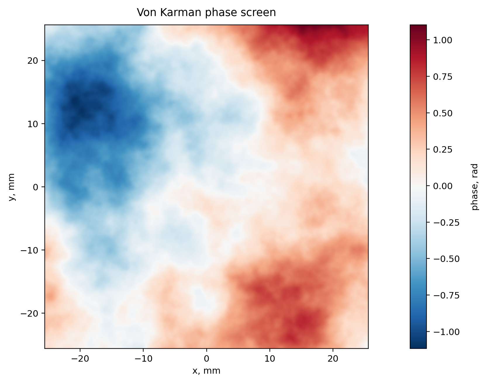

<em>Рисунок 6 — Пример фазового экрана, сгенерированного по спектру фон Кармана. Крупные области соответствуют низким пространственным частотам, а мелкая структура — высокочастотным компонентам спектра.</em>

---

## 5.2. Спектр фазового экрана

В практических численных моделях двумерная спектральная плотность фазового экрана часто задаётся выражением

$$
\Phi_\phi(f)
=
0.023 r_0^{-5/3}
\left(f^2+f_0^2\right)^{-11/6}
\exp\left[-\left(\frac{f}{f_m}\right)^2\right],
$$

где

$$
f=\sqrt{f_x^2+f_y^2},
\qquad
f_0=\frac{1}{L_0},
\qquad
f_m=\frac{5.92}{2\pi l_0}.
$$

В этом выражении параметр $r_0$ задаёт общую силу фазовых искажений, $L_0$ ограничивает крупномасштабные искажения, а $l_0$ ограничивает мелкомасштабную структуру. Уменьшение $r_0$ приводит к увеличению дисперсии фазы, увеличение $L_0$ усиливает вклад низких частот, а уменьшение $l_0$ допускает более мелкие детали фазового экрана.

---

## 5.3. Генерация фазового экрана спектральным методом

Общая схема генерации фазового экрана через спектральный метод состоит из следующих шагов:

1. задаётся сетка пространственных частот $(f_x,f_y)$;
2. вычисляется спектральная плотность $\Phi_\phi(f_x,f_y)$;
3. генерируется комплексный белый шум $W(f_x,f_y)$;
4. шум масштабируется по спектру:

$$
\tilde \phi(f_x,f_y)=
W(f_x,f_y)\sqrt{\Phi_\phi(f_x,f_y)}\Delta f;
$$

5. выполняется обратное преобразование Фурье:

$$
\phi(x,y)=\mathcal F^{-1}\{\tilde\phi(f_x,f_y)\}.
$$

После генерации обычно вычитают среднее значение:

$$
\phi(x,y)\leftarrow \phi(x,y)-\langle\phi\rangle.
$$

Постоянная добавка к фазе не влияет на интенсивность и не меняет форму волнового фронта, поэтому её можно исключить.

---

## 5.4. Примеры фазовых экранов при изменении параметров

Фазовый экран удобно рассматривать не только как случайную картинку, но и как наглядное отображение параметров модели. Визуально разные параметры отвечают за разные свойства фазовой карты. Параметр Фрида $r_0$ задаёт общую силу фазовых искажений: чем меньше $r_0$, тем быстрее фаза меняется по апертуре и тем сильнее искажается волновой фронт. Внешний масштаб $L_0$ управляет вкладом низких пространственных частот, то есть крупномасштабных областей фазы. Внутренний масштаб $l_0$ ограничивает мелкомасштабные детали, связанные с высокими пространственными частотами.

  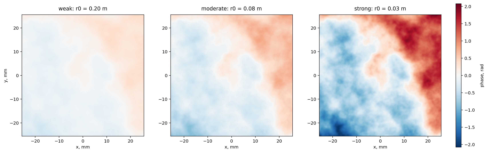

<em>Рисунок 7 — Фазовые экраны при разных значениях параметра Фрида $r_0$. При уменьшении $r_0$ турбулентность становится сильнее: характерные перепады фазы возрастают, а волновой фронт становится менее гладким на масштабе апертуры.</em>

С физической точки зрения $r_0$ можно интерпретировать как эффективный размер области, внутри которой волновой фронт ещё остаётся достаточно согласованным. Если апертура имеет диаметр $D\ll r_0$, то значительная часть волнового фронта внутри апертуры близка к плоской. Если $D\gg r_0$, то внутри одной апертуры помещается много независимых фазовых областей, и восстановление или компенсация фазы становится существенно сложнее.

  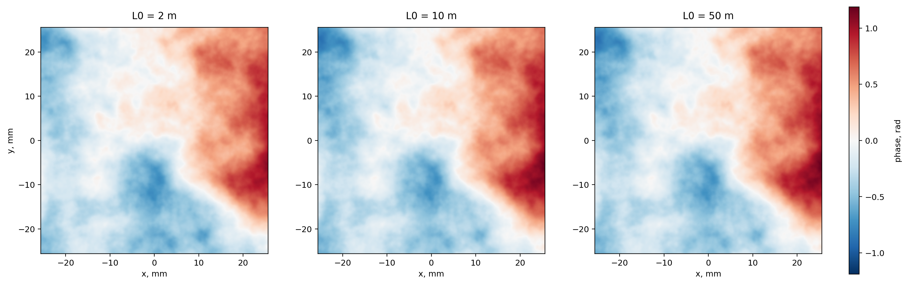

<em>Рисунок 8 — Фазовые экраны при разных значениях внешнего масштаба $L_0$. Увеличение $L_0$ усиливает вклад крупномасштабных фазовых неоднородностей. Такие компоненты часто проявляются как наклон, дефокусировка или медленно меняющаяся кривизна волнового фронта.</em>

Внешний масштаб не просто задаёт максимальный размер вихрей. В численной модели он также предотвращает расходимость спектра при малых пространственных частотах. Если $L_0$ слишком велик по сравнению с размером расчётной области, экран может содержать выраженные крупные компоненты, которые на конечной апертуре выглядят почти как наклон или низшие аберрации.

  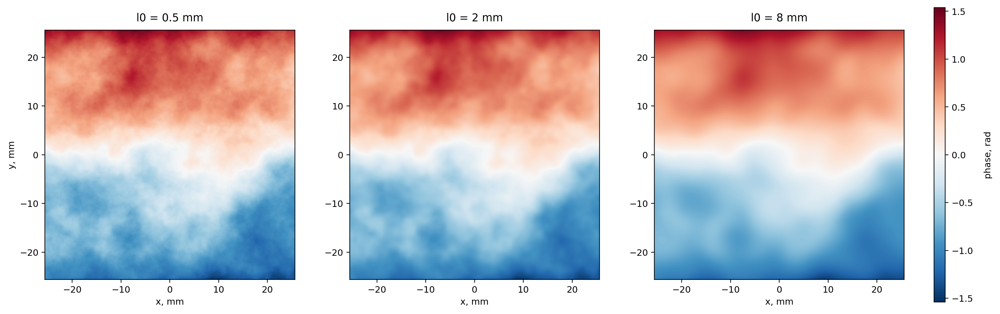

<em>Рисунок 9 — Фазовые экраны при разных значениях внутреннего масштаба $l_0$. Увеличение $l_0$ подавляет высокочастотные компоненты и делает фазовый экран более гладким. Уменьшение $l_0$ допускает более мелкую структуру фазы.</em>

Внутренний масштаб связан с областью диссипации турбулентности. В практических расчётах он также важен с численной точки зрения: если $l_0$ меньше шага сетки, высокочастотная часть спектра не может быть корректно представлена. Поэтому параметры $l_0$, $\Delta x$ и размер сетки $N$ должны быть согласованы между собой.

  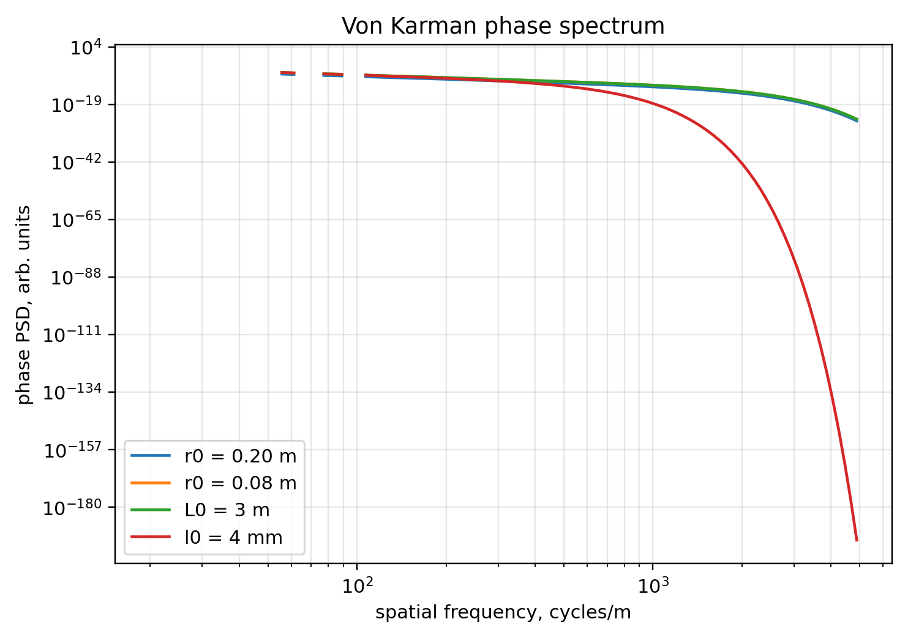

<em>Рисунок 10 — Радиально усреднённые спектральные плотности фазовых экранов для нескольких наборов параметров. Параметр $r_0$ меняет общий уровень спектра, $L_0$ влияет на низкие пространственные частоты, а $l_0$ — на спад высокочастотной части.</em>

Такое сравнение полезно тем, что связывает визуальную форму фазовых экранов с их спектральным описанием. Крупные пятна на фазовой карте соответствуют низким пространственным частотам, а резкие мелкие детали — высокочастотной части спектра. Поэтому анализ только изображения без понимания спектра может быть обманчивым: два экрана могут выглядеть похожими по амплитуде фазы, но иметь разный вклад низких и высоких частот.

---

# 6. Распространение через турбулентную трассу

## 6.1. Split-step схема

Протяжённую турбулентную трассу удобно моделировать последовательностью свободных распространений и фазовых экранов. Если длина трассы равна $L$, а число экранов равно $N_{\mathrm{screens}}$, то шаг по продольной координате равен

$$
\Delta z=\frac{L}{N_{\mathrm{screens}}}.
$$

Одна из распространённых симметричных схем имеет вид

$$
U_0
\rightarrow
\mathcal P_{\Delta z/2}
\rightarrow
e^{i\phi_1}
\rightarrow
\mathcal P_{\Delta z}
\rightarrow
e^{i\phi_2}
\rightarrow
\cdots
\rightarrow
e^{i\phi_N}
\rightarrow
\mathcal P_{\Delta z/2}
\rightarrow
U_L.
$$

Половинные шаги распространения в начале и в конце используются для более симметричного размещения фазовых экранов относительно интервалов свободного распространения.

Если $r_0$ задан для всей трассы, а экранов несколько, то для каждого отдельного экрана используют более слабую турбулентность. Для независимых экранов часто используется масштабирование

$$
r_{0,\mathrm{screen}}=r_0 N_{\mathrm{screens}}^{3/5}.
$$

Такое масштабирование связано с тем, что фазовая дисперсия на трассе складывается по слоям, а параметр Фрида входит в фазовую структурную функцию как $r_0^{-5/3}$.

---

## 6.2. Набор фазовых экранов вдоль трассы

При моделировании протяжённой атмосферы один экран заменяется набором экранов, расположенных вдоль направления распространения. Каждый экран описывает фазовый набег на отдельном участке трассы. Между экранами поле распространяется в свободном пространстве, поэтому фазовые искажения постепенно преобразуются в амплитудные флуктуации.

  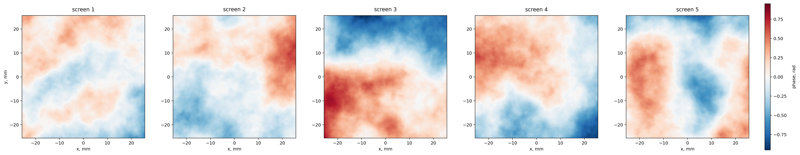

<em>Рисунок 11 — Пример пяти независимых фазовых экранов, используемых в split-step модели. Каждый экран соответствует отдельному тонкому слою турбулентности. В совокупности они задают протяжённую турбулентную трассу.</em>

Число экранов $N_{\mathrm{screens}}$ выбирается как компромисс между физической детализацией и вычислительной стоимостью. Если экранов слишком мало, вся турбулентность сосредоточена в небольшом числе тонких слоёв, что может грубо приближать реальное распределение неоднородностей. Если экранов слишком много, расчёт становится дороже, поскольку для каждого участка требуется дополнительное распространение поля.

---

## 6.3. Результат прохождения через турбулентность

После прохождения через турбулентную трассу поле обычно приобретает сложную фазовую структуру. При дальнейшем распространении фазовые искажения приводят к перераспределению интенсивности. Это проявляется в смещении центра пучка, появлении локальных максимумов и минимумов интенсивности, а также в ухудшении фокусировки.

  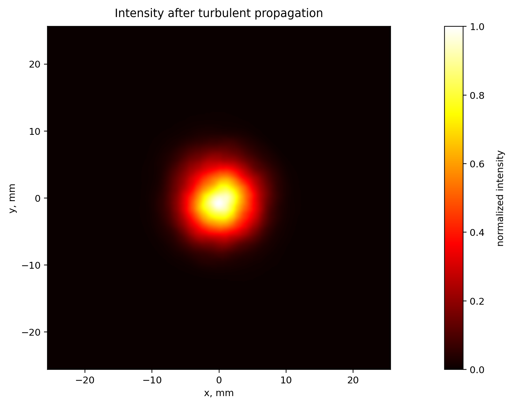

<em>Рисунок 12 — Нормированная интенсивность после распространения через турбулентную трассу. По сравнению со свободным распространением распределение становится менее регулярным из-за преобразования фазовых искажений в амплитудные флуктуации.</em>

  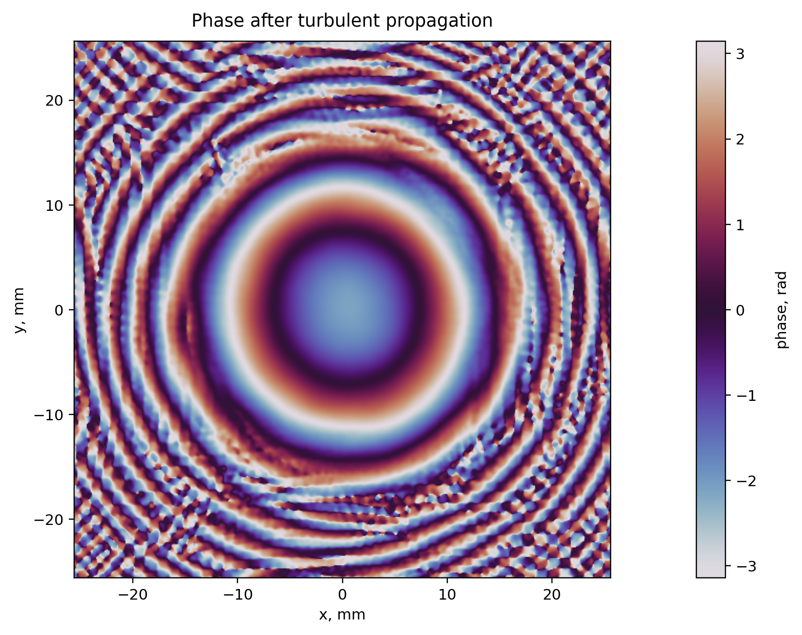

<em>Рисунок 13 — Фаза поля после распространения через турбулентную трассу. Фазовая карта содержит как крупномасштабные компоненты, отвечающие за наклон и дефокусировку, так и более мелкие флуктуации, связанные с высокими пространственными частотами турбулентности.</em>

  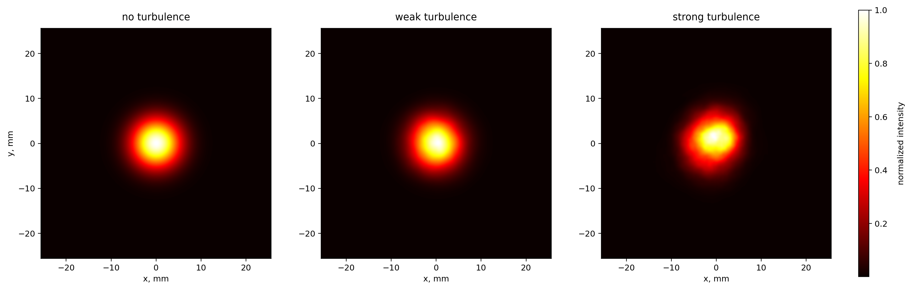

<em>Рисунок 14 — Сравнение выходной интенсивности без турбулентности, при слабой турбулентности и при сильной турбулентности. При уменьшении $r_0$ возрастает неоднородность интенсивности, усиливается смещение энергетического центра и ухудшается регулярность поперечного профиля пучка.</em>

Этот пример показывает, почему фазовые искажения нельзя оценивать только по фазовой карте в плоскости экрана. Даже если экран непосредственно меняет только фазу, дальнейшее распространение переводит фазовую модуляцию в искажения интенсивности. Именно этот эффект лежит в основе многих задач восстановления волнового фронта по измеряемым распределениям интенсивности или интерферограммам.

---

# 7. Скоррелированные фазовые экраны

## 7.1. Назначение скоррелированных экранов

Если моделируется один независимый кадр, фазовые экраны можно генерировать независимо. Однако при моделировании временной последовательности или нескольких связанных состояний атмосферы соседние экраны должны быть скоррелированы. Это необходимо для описания временной динамики турбулентности, моделирования движущихся слоёв атмосферы и получения реалистичных последовательностей кадров.

---

## 7.2. Замороженная турбулентность Тейлора

Простейшая модель временной корреляции основана на гипотезе замороженной турбулентности Тейлора. Предполагается, что за малое время структура турбулентности почти не меняется, а переносится ветром:

$$
\phi(x,y,t+\Delta t)=
\phi(x-v_x\Delta t,\,y-v_y\Delta t,\,t).
$$

Здесь $(v_x,v_y)$ — поперечная скорость ветра. Практически это означает, что можно сгенерировать большой фазовый экран и двигать по нему апертуру. Последовательность вырезок из одного большого экрана автоматически будет пространственно и временно скоррелированной.

  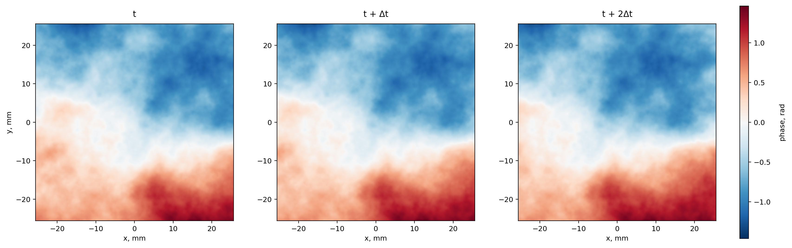

<em>Рисунок 15 — Пример скоррелированных фазовых экранов, полученных как последовательные вырезки из одного большого экрана. Такая конструкция соответствует переносу «замороженной» турбулентной структуры поперечным ветром.</em>

В отличие от независимой генерации, такая последовательность сохраняет похожие крупные структуры между соседними кадрами. Это важно для моделирования временной динамики адаптивной оптики: реальная атмосфера обычно не меняется скачком от кадра к кадру, а эволюционирует непрерывно.

---

## 7.3. Авторегрессионная модель

Другой способ состоит в построении последовательности экранов по формуле

$$
\phi_{t+\Delta t}=
\alpha\phi_t+
\sqrt{1-\alpha^2}\eta_t.
$$

Здесь $\eta_t$ — новый независимый фазовый экран с той же статистикой, а $\alpha\in[0,1]$ — коэффициент корреляции. При $\alpha=0$ экраны независимы, а при $\alpha\approx1$ соседние экраны сильно похожи. Коэффициент $\alpha$ можно связать с характерным временем корреляции $\tau$:

$$
\alpha=\exp\left(-\frac{\Delta t}{\tau}\right).
$$

Такая модель проще, чем перенос большого экрана, но хуже описывает направленное движение турбулентных неоднородностей.

---

# 8. Итоговая модель

В результате численная модель распространения через турбулентную атмосферу включает следующие элементы:

1. задание начального комплексного поля $U_0(x,y)$;
2. выбор расчётной сетки $N$, $L_{\mathrm{box}}$, $\Delta x$;
3. выбор длины волны $\lambda$ и расстояния распространения $L$;
4. моделирование свободного распространения оператором $\mathcal P_z$;
5. генерацию фазовых экранов с параметрами $r_0$, $L_0$, $l_0$;
6. последовательное применение свободного распространения и фазовых экранов;
7. анализ итоговой интенсивности $|U|^2$ и фазы $\arg U$.

Без турбулентности поле в выходной плоскости имеет вид

$$
U_L=\mathcal P_L U_0.
$$

При наличии турбулентности оно задаётся композицией операторов свободного распространения и фазовых множителей:

$$
U_L
=
\mathcal P_{\Delta z/2}
\left[
e^{i\phi_N}
\mathcal P_{\Delta z}
\left[
\cdots
e^{i\phi_2}
\mathcal P_{\Delta z}
\left[
e^{i\phi_1}
\mathcal P_{\Delta z/2}U_0
\right]
\right]
\right].
$$

Эта модель является достаточно простой для численной реализации и одновременно отражает ключевые физические эффекты: дифракцию, случайный фазовый набег, влияние масштаба турбулентности и преобразование фазовых возмущений в искажения интенсивности.

---

# 9. Краткий список обозначений

| Обозначение | Смысл |
|---|---|
| $U(x,y,z)$ | комплексная амплитуда поля |
| $A(x,y,z)$ | амплитуда поля |
| $I(x,y,z)$ | интенсивность |
| $\varphi(x,y,z)$ | фаза поля |
| $\lambda$ | длина волны |
| $k=2\pi/\lambda$ | волновое число |
| $N$ | число узлов расчётной сетки |
| $L_{\mathrm{box}}$ | размер расчётной области |
| $\Delta x$ | шаг сетки |
| $w_0$ | характерный радиус гауссова пучка |
| $C_n^2$ | структурная постоянная показателя преломления |
| $r_0$ | параметр Фрида |
| $L_0$ | внешний масштаб турбулентности |
| $l_0$ | внутренний масштаб турбулентности |
| $\phi(x,y)$ | фазовый экран |
| $\mathcal P_z$ | оператор свободного распространения |
| $N_F$ | число Френеля |
| $N_{\mathrm{screens}}$ | число фазовых экранов |
| $\Delta z$ | расстояние между соседними экранами |
